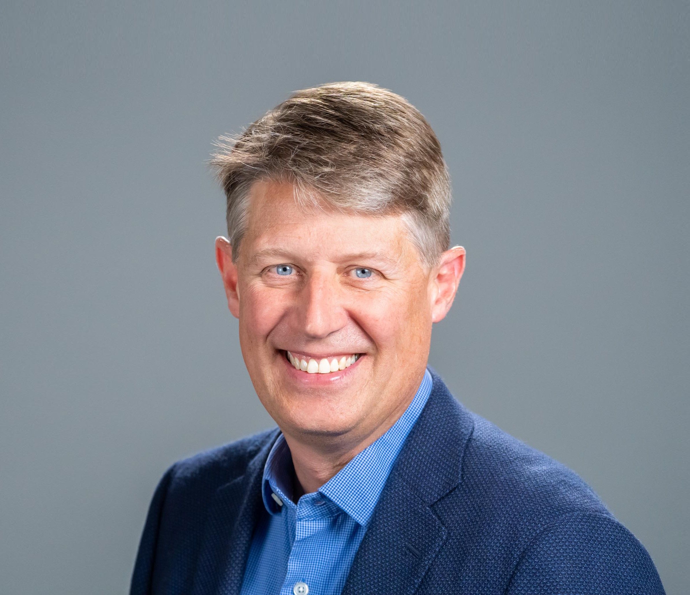

---
# Feel free to add content and custom Front Matter to this file.
# To modify the layout, see https://jekyllrb.com/docs/themes/#overriding-theme-defaults

title: Faculty
layout: base
---



	<h1>Faculty</h1>

	 
	
<strong>Alexis Kaminski</strong> 
	Prof. Kaminski's research focuses on stratified geophysical and environmental flows, such as those in the ocean and atmosphere. In particular, she is interested in waves and instabilities in stratified flows, and how these flows transition to turbulence and mix the background state. She uses a range of approaches to study these problems, including numerical simulations, theory, and observations from the upper ocean. More info can be found at her <a href="https://akkaminski.github.io">website</a>. 
	

	 
	
<strong>Cynthia Gerlein-Safdi</strong> 
	Professor Gerlein-Safdi's research focuses on ecohydrology and the connections between the water and the carbon cycles in natural ecosystems. Current projects include leveraging new remote sensing techniques to map out wetlands for methane emissions modeling, effects of climate warming on fog water use by vegetation along the California coast, and the development of new methods related to solar-induced chlorophyll fluorescence to understand the link between water availability and photosynthesis.
	<a href="https://sites.google.com/berkeley.edu/gerlein-safdi/">Website</a>.
	

	 
	
<strong>Evan Variano</strong> 
	***
	

	 
	
<strong>Tina Chow</strong> 
	***
	https://chow.ce.berkeley.edu/
	

	 
	
<strong>Mark Stacey</strong> 
	Professor Stacey's academic activities focus on coastal climate change and adaptation. His research emphasizes the interaction of environmental and anthropogenic processes in coastal regions, where he uses a range of methods (numerical, observational, theoretical) to quantify and understand interdependencies in the system. Recent work has highlighted how shoreline policies and projects interact with environmental processes, leading to regional change. Professor Stacey teaches courses focusing on climate change adaptation broadly (undergraduate), climate resilient infrastructure (graduate), and environmental fluid mechanics (undergraduate and graduate).
	<!-- <a href="https://ce.berkeley.edu/people/faculty/stacey">Site</a> -->
	

&nbsp;

 