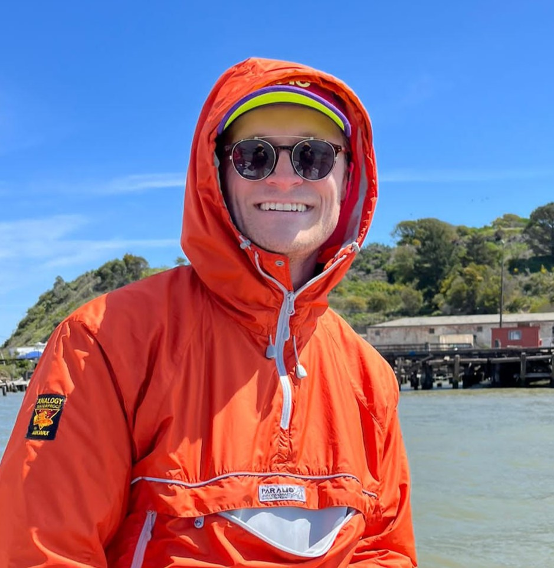
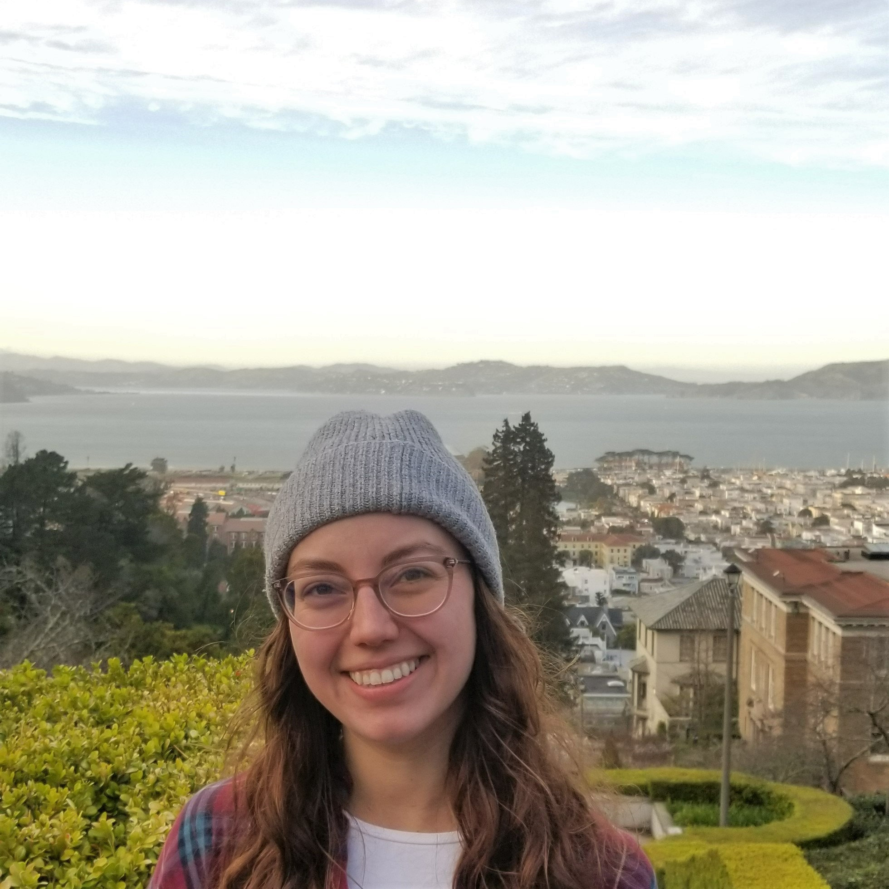
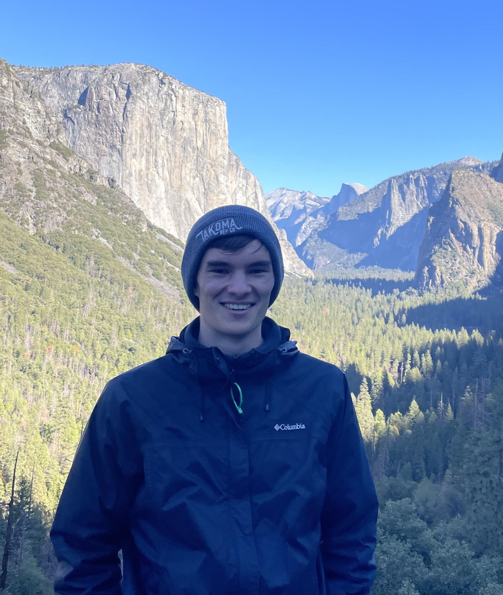
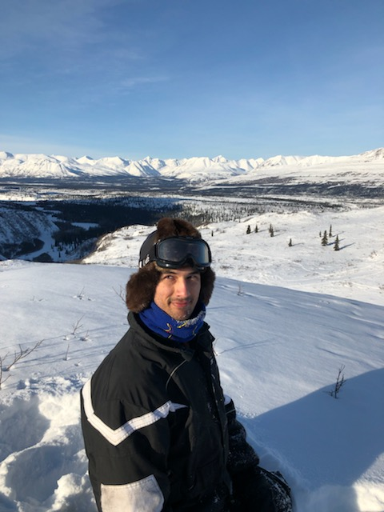
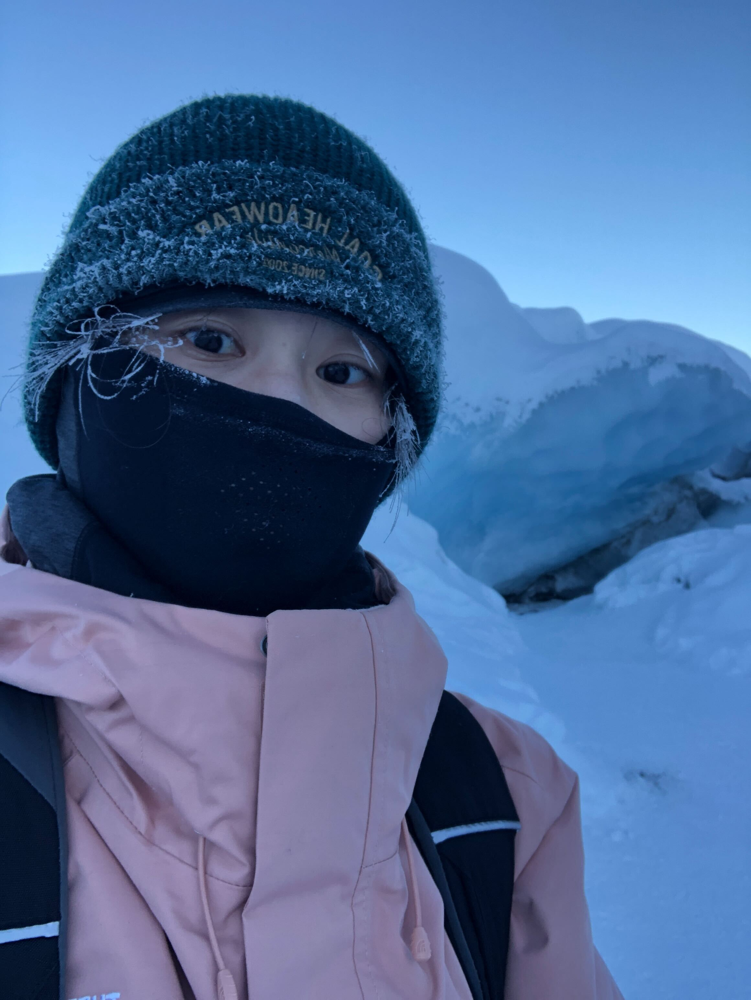
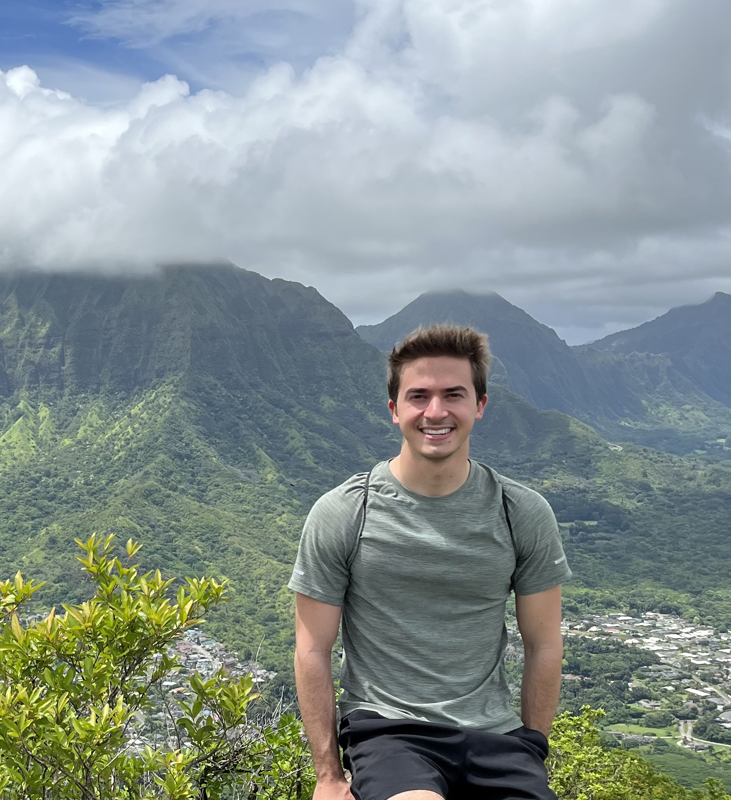

---
# Feel free to add content and custom Front Matter to this file.
# To modify the layout, see https://jekyllrb.com/docs/themes/#overriding-theme-defaults

title: Students
layout: base
---



	<h1>Students</h1>

	 
	
<strong>Lukas WinklerPrins</strong> 
	Lukas researches connections between hydrologic conditions, sediment transport, and geomorphology in estuaries. He is particularly interested in the impacts of changing climate and anthropogenic modification on restoration and conservation of wetlands. Contrary to his background in mathematics, he loves doing field work. 

	 <a href="mailto:lukas_wp@berkeley.edu">lukas_wp@berkeley.edu</a>

	 
	
<strong>Ann Scheliga</strong> 
	Ann's research focuses on large-scale anthropogenic processes impacting terrestrial hydrology. Currently, she is working on comparing modeled and observational contributions to sea-level rise. She is particularly interested in the use of satellite observations to improve groundwater estimates in climate models.

	 
	
<strong>Paul Seibert</strong> 
	Paul's research focuses on remote sensing data assimilation in the context of ecohydrology. Currently, this takes the form of using TROPOMI solar-induced fluorescence data to predict evapotranspiration at a field site in Colorado.

	 
	
<strong>Alexandre Georges</strong> 
	Alexandre's work focuses on sediment transport, hydrology, remote sensing and hydrodynamic modeling to not only track the evolution of mangrove forests in Haiti and the Caribbean, but also study their potential as natural coastal protection infrastructure against sea-level rise. He is also interested in the use of Data Science and Public Policy to tackle the challenge of climate change in the Caribbean region.

	 
	
<strong>Lily Engel</strong> 
	Lily’s current research uses idealized numerical models to study physical-biological interactions in an estuary including what she calls the Peter-Parker Model. After graduation, she will be using larval-transport models to predict the spread of the invasive European Green Crab in the Salish Sea at Pacific Northwest National Laboratory-Seattle as a postdoc. In her free time, she enjoys hiking, rock climbing, trying new restaurants, and choral singing.
	

	 
	
<strong>Tvetene Carlson</strong> 
	Tvetene is an experimentalist and community engaged researcher. He's studying tidal renewable energy in particular by characterizing the hydrodynamic properties of a novel kite system in a flume and soon tow tank. He's particularly excited to conduct interviews with Alaskan Native elders, hunter, fishers, and other subsistence practitioners about how this system and other renewable energy systems could impact Native food systems and culture.
	

	 
	
<strong>Tianjiao Pu</strong> 
	Tianjiao is focusing on mapping waterbodies and flooding combining CYGNSS and machine learning techniques to improve methane emissions and better understand how areas of flooding and wildfires can emerge in various landscapes under specific hydrological conditions.
	

	 
	
<strong>Vincent Laroche</strong> 
	Vincent's current research explores the impact of small-scale ocean mixing on phytoplankton blooms and carbon export into the ocean interior. He studies this using direct numerical simulations of an idealized nutrient-phytoplankton model in the context of a stratified shear instability event.
	

&nbsp;

 