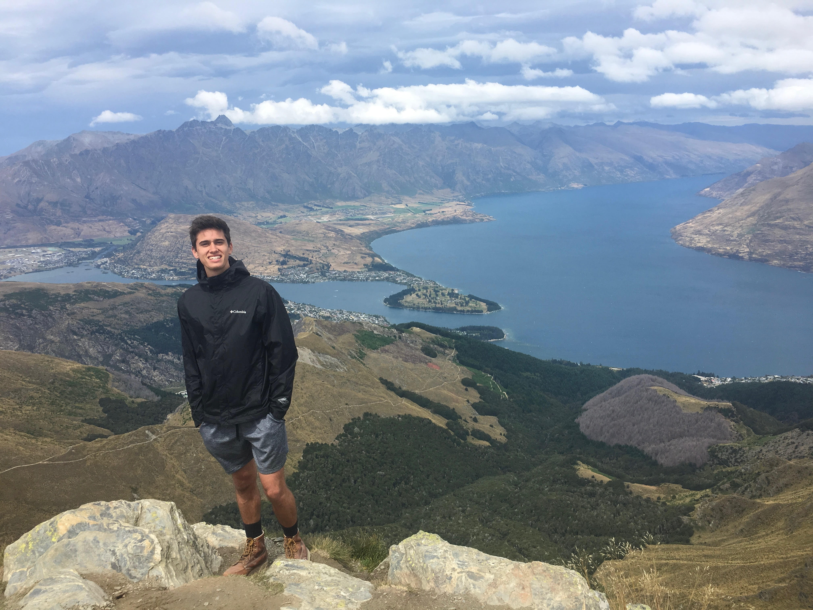
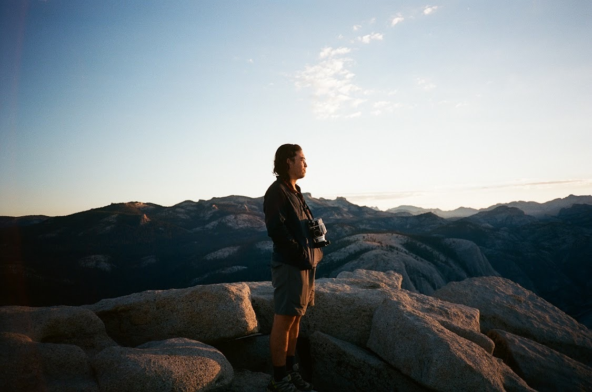
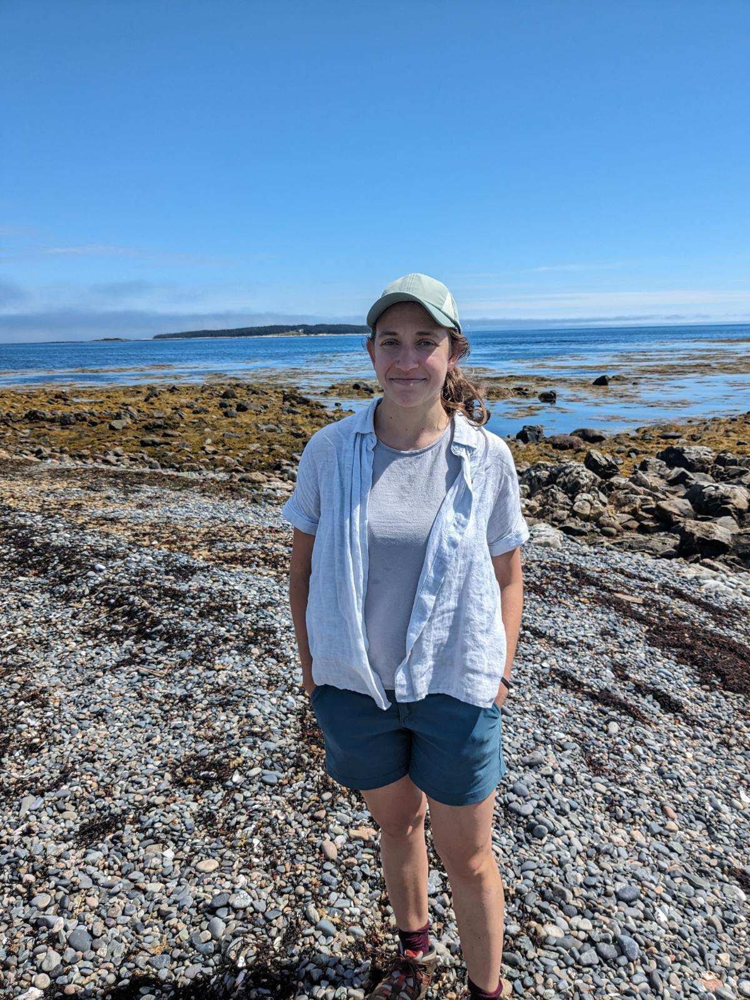
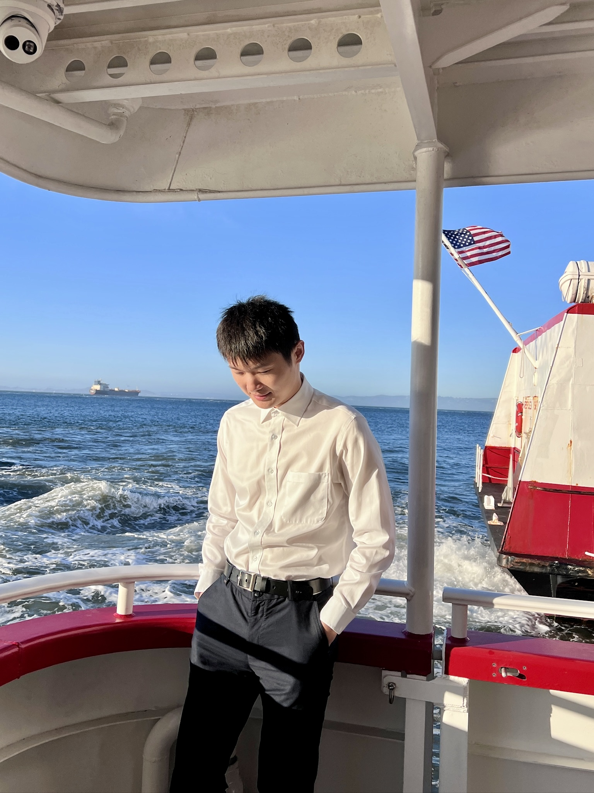

---
# Feel free to add content and custom Front Matter to this file.
# To modify the layout, see https://jekyllrb.com/docs/themes/#overriding-theme-defaults

title: Students
layout: base
---



	<h1>Students</h1>

	 
	
<strong>Ann Scheliga</strong> 
	Ann's research focuses on large-scale anthropogenic processes impacting terrestrial hydrology. Currently, she is working on comparing modeled and observational contributions to sea-level rise. She is particularly interested in the use of satellite observations to improve groundwater estimates in climate models.

	 
	
<strong>Paul Seibert</strong> 
	Paul's current research explores the ecohydrological dynamics of California's coastal grasslands. He is particularly interested in the role of fog in ecosystem water use efficiency. In addition, Paul works with a novel ground-based solar-induced fluorescence imager to understand the drivers of photosynthesis across landscapes via remote sensing. 
	
 
	  <a href="https://paul-seibert.github.io/">website</a> / <a href="mailto:paul_seibert@berkeley.edu">paul_seibert@berkeley.edu</a>

	 
	
<strong>Alexandre Georges</strong> 
	Alexandre's work focuses on hydrology, remote sensing and hydrodynamic modeling to not only track the evolution of mangrove forests in Haiti and the Caribbean, but also study their potential as natural coastal protection infrastructure against sea-level rise. He is interested in data-driven and equitable adaptations to tackle the challenge of climate change in the Caribbean region.

<!--

	 
	
<strong>Lily Engel</strong> 
	Lily’s current research uses idealized numerical models to study physical-biological interactions in an estuary including what she calls the Peter-Parker Model. After graduation, she will be using larval-transport models to predict the spread of the invasive European Green Crab in the Salish Sea at Pacific Northwest National Laboratory-Seattle as a postdoc. In her free time, she enjoys hiking, rock climbing, trying new restaurants, and choral singing.
	

-->

	 
	
<strong>Tvetene Carlson</strong> 
	Tvetene is an experimentalist and community engaged researcher. He's studying tidal renewable energy in particular by characterizing the hydrodynamic properties of a novel kite system in a flume and soon tow tank. He's particularly excited to conduct interviews with Alaskan Native elders, hunter, fishers, and other subsistence practitioners about how this system and other renewable energy systems could impact Native food systems and culture.
	

	 
	
<strong>Tianjiao Pu</strong> 
	Tianjiao is focusing on mapping waterbodies and flooding combining CYGNSS and machine learning techniques to improve methane emissions and better understand how areas of flooding and wildfires can emerge in various landscapes under specific hydrological conditions.
	

	 
	
<strong>Vincent Laroche</strong> 
	Vincent's current research explores the impact of small-scale ocean mixing on phytoplankton blooms and carbon export into the ocean interior. He studies this using direct numerical simulations of an idealized nutrient-phytoplankton model in the context of a stratified shear instability event.
	

	 
	
<strong>Matthew Falcone</strong> 
	Matt researches the hydrodynamics of coastal ecosystems, currently focusing on the role of vegetation in nearshore processes such as wave attenuation. His work on coastal green infrastructure (e.g, marshes) connects to his broader interests in climate change adaptation and planning.
	

	 
	
<strong>Shuai Meng</strong> 
	Shuai’s work focuses on the data-driven analysis in the context of stratified shear instability events in the transition layer of ocean. Currently, he is working on the energy budget and mixing efficiency of the Kelvin-Helmholtz and Holmboe instabilities based on numerical simulations. He is particularly interested in the applications of physics-informed neural networks in the field of oceanography. 
	

	 
	
<strong>Adam Wise</strong> 
		Adam’s research focuses on multiscale atmospheric modeling applied to wind energy. His focus is on how the interaction between thermal stratification and terrain can impact turbulent flow features. He then models how this turbulence affects wind turbine wakes and wind farm efficiency. He uses dynamic turbulence modeling methods to more efficiently simulate turbulent flow in a range of atmospheric stability conditions.
	

	 
	
<strong>Kelly Clevenson</strong> 
		Kelly’s work focuses on the ignition and spread of wildfires! Currently, she is focused on analyzing a dataset of fire spread over a gap under different conditions in order to better understand and predict safety zones for wildland firefighters. Additionally, Kelly does some research on how convective heat transfer impacts the ignition of small diameter fuels.
	

	 
	
<strong>Jenna Israel</strong> 
		Jenna is interested in mechanistic approaches to predicting the response of ecosystems to climate change. She works on projects with a variety of methods, from lab experimnets investigating the thermodynamics of microbial carbon cycling to hydrodynamic simulations of salinity intrusion in the Sacramento-San Joaquin Delta. Common themes include physics-based modeling of energy flows and their signatures.
	

	 
	
<strong> Zichuan (Leo) Li</strong> 
		Leo studies turbulent plumes in natural environments, such as volcanic eruptions and forest fires. Using direct numerical simulations, he aims to remotely determine source conditions and investigate the physical mechanisms of mixing and entrainment at the plume/ambient interface. His current work focuses on how time-varying source conditions affect plume dynamics.
	

&nbsp;

 
